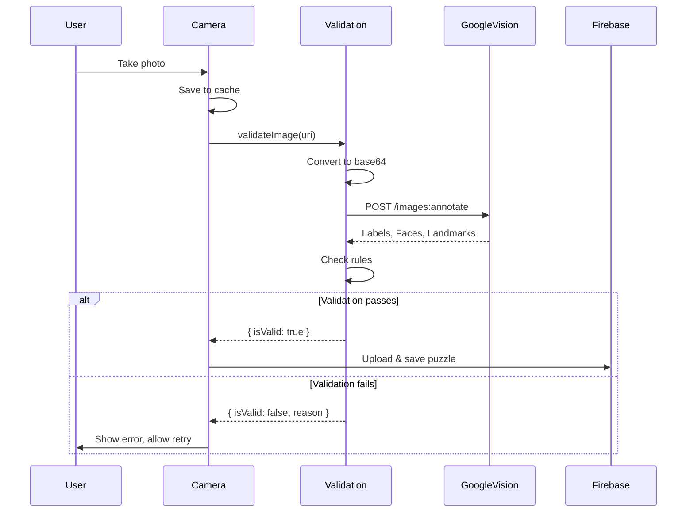
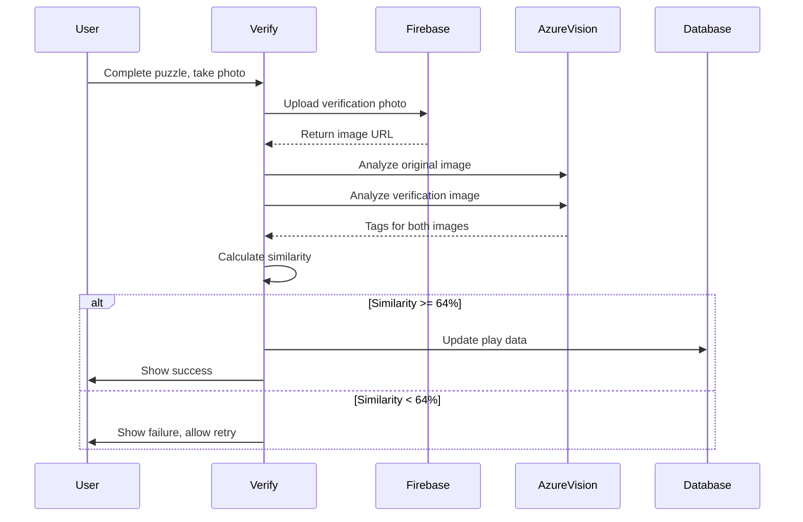

# AI Implementation Documentation
## Photo Hunt - Computer Vision Integration

**Version:** 1.0  
**Last Updated:** 2024  
**Author:** Development Team

---

## Table of Contents

1. [Overview](#overview)
2. [Architecture](#architecture)
3. [AI Services](#ai-services)
4. [Implementation Details](#implementation-details)
5. [Code Walkthrough](#code-walkthrough)
6. [API Configuration](#api-configuration)
7. [Workflows](#workflows)
8. [Error Handling](#error-handling)
9. [Performance Considerations](#performance-considerations)
10. [Testing Guide](#testing-guide)

---

## Overview

Photo Hunt is a React Native mobile application that uses AI-powered computer vision to:
- **Validate puzzle images** during creation (Google Cloud Vision API)
- **Verify puzzle completion** by comparing user photos with original images (Azure Computer Vision API)

### Key Features
- Multi-feature image analysis (labels, faces, landmarks)
- Parallel image processing for performance
- Tag-based similarity comparison algorithm
- Comprehensive error handling and user feedback

---

## Architecture

### System Architecture Diagram

```
┌─────────────────────────────────────────────────────────┐
│                    Photo Hunt App                        │
└─────────────────────────────────────────────────────────┘
                            │
        ┌───────────────────┴───────────────────┐
        │                                       │
┌───────▼────────┐                    ┌─────────▼──────────┐
│ Puzzle Creation│                    │ Puzzle Verification│
│   Workflow     │                    │     Workflow       │
└───────┬────────┘                    └─────────┬──────────┘
        │                                       │
        │                                       │
┌───────▼──────────────────────────────────────▼──────────┐
│              AI Service Layer                            │
│  ┌──────────────────┐        ┌──────────────────────┐  │
│  │ Google Vision API│        │ Azure Vision API     │  │
│  │ - Label Detection│        │ - Tag Extraction     │  │
│  │ - Face Detection │        │ - Similarity Compare  │  │
│  │ - Landmark Detect│        │                      │  │
│  └──────────────────┘        └──────────────────────┘  │
└──────────────────────────────────────────────────────────┘
```

### Component Structure

```
Photo-Hunt/
├── utils/
│   ├── imageValidation.ts          # Google Vision API integration
│   └── azureImageComparison.ts     # Azure Vision API integration
├── config/
│   └── azure-endpoints.ts          # Azure API configuration
└── app/
    ├── (protected)/(tabs)/(newgamestack)/
    │   └── camera.tsx              # Puzzle creation with validation
    └── (protected)/(tabs)/(mapstack)/
        └── validateCamera.tsx      # Puzzle verification
```

---

## AI Services

### 1. Google Cloud Vision API

**Purpose:** Content validation and understanding  
**Location:** `utils/imageValidation.ts`

**Features Used:**
- **LABEL_DETECTION**: Identifies objects, scenes, and concepts in images
- **FACE_DETECTION**: Detects human faces
- **LANDMARK_DETECTION**: Recognizes famous landmarks

**Use Case:** Validates that puzzle images contain appropriate content (buildings/landmarks) and exclude faces.

### 2. Azure Computer Vision API

**Purpose:** Image similarity comparison  
**Location:** `utils/azureImageComparison.ts`

**Features Used:**
- **Tag Extraction**: Analyzes images and extracts descriptive tags
- **Similarity Algorithm**: Custom tag-based comparison

**Use Case:** Compares user verification photos with original puzzle images to confirm completion.

---

## Implementation Details

### Google Cloud Vision Integration

#### Function Signature
```typescript
export async function validateImage(uri: string): Promise<ValidationResult>
```

#### Request Structure
```typescript
{
  requests: [{
    image: { content: base64Image },
    features: [
      { type: "LABEL_DETECTION", maxResults: 10 },
      { type: "FACE_DETECTION", maxResults: 1 },
      { type: "LANDMARK_DETECTION", maxResults: 5 }
    ]
  }]
}
```

#### Validation Rules
1. **Face Check**: Rejects images containing faces
2. **Content Check**: Requires at least one of:
   - Landmark detection (famous landmarks)
   - Required labels: Building, Architecture, Landmark, Structure, Place

#### Response Processing
```typescript
interface ValidationResult {
  isValid: boolean;
  reason?: string;
}
```

### Azure Computer Vision Integration

#### Function Signature
```typescript
export const compareImagesAzure = async (
  image1: string, 
  image2: string
): Promise<{ score: string; common: string[] } | undefined>
```

#### Similarity Algorithm

**Formula:**
```
similarity_score = (common_tags / max(total_tags1, total_tags2)) × 100
```

**Threshold:** 64% (configurable)

**Implementation:**
```typescript
const compareTags = (tags1: string[], tags2: string[]) => {
  const common = tags1.filter(tag => tags2.includes(tag));
  const score = (common.length / Math.max(tags1.length, tags2.length)) * 100;
  return { score: score.toFixed(2), common };
};
```

#### Parallel Processing
Both images are analyzed simultaneously using `Promise.all`:
```typescript
const [data1, data2] = await Promise.all([
  analyzeImage(image1),
  analyzeImage(image2),
]);
```

---

## Code Walkthrough

### Puzzle Creation Flow

**File:** `app/(protected)/(tabs)/(newgamestack)/camera.tsx`

**Step-by-Step:**

1. **User takes photo**
   ```typescript
   const result = await ImagePicker.launchCameraAsync({
     allowsEditing: true,
     aspect: [4, 3],
     quality: 0.7,
   });
   ```

2. **Image preparation**
   ```typescript
   const fileName = `photo_${Date.now()}.jpg`;
   const newUri = `${FileSystem.cacheDirectory}${fileName}`;
   await FileSystem.copyAsync({ from: originalUri, to: newUri });
   ```

3. **AI validation**
   ```typescript
   const validation = await validateImage(newUri);
   if (!validation.isValid) {
     // Show error and allow retry
   }
   ```

4. **Save to database** (if validation passes)

### Puzzle Verification Flow

**File:** `app/(protected)/(tabs)/(mapstack)/validateCamera.tsx`

**Step-by-Step:**

1. **User captures verification photo**
   ```typescript
   const result = await ImagePicker.launchCameraAsync({
     quality: 0.8,
     base64: true,
     allowsEditing: false,
   });
   ```

2. **Upload to Firebase Storage**
   ```typescript
   const imageUrl = await uploadImageAzureFirebase(
     photo.uri, 
     'verificationPhotos'
   );
   ```

3. **Prepare image URLs**
   ```typescript
   const objectPath = encodeURIComponent(
     (originalImageUri as string).split('/o/')[1].split('?')[0]
   );
   const neworiginalimageURI = /* construct URL */;
   ```

4. **AI comparison**
   ```typescript
   const results = await compareImagesAzure(
     neworiginalimageURI, 
     imageUrl
   );
   ```

5. **Threshold check**
   ```typescript
   const SIMILARITY_THRESHOLD = 64;
   const azureScore = parseFloat(results.score);
   const isSimilar = azureScore >= SIMILARITY_THRESHOLD;
   ```

6. **Update database** (if similarity threshold met)

---

## API Configuration

### Google Cloud Vision API

**Configuration Location:** Environment variables

**Required Environment Variables:**
```env
GOOGLE_CLOUD_API_KEY=your_api_key_here
```

**API Endpoint:**
```
https://vision.googleapis.com/v1/images:annotate?key={API_KEY}
```

**Authentication:** API Key in query parameter

### Azure Computer Vision API

**Configuration Location:** `config/azure-endpoints.ts`

**Required Environment Variables:**
```env
AZURE_VISION_ENDPOINT=https://your-resource.cognitiveservices.azure.com/
AZURE_VISION_KEY=your_subscription_key
```

**API Endpoint Construction:**
```typescript
const endpoint = AZURE_VISION_ENDPOINT?.endsWith('/') 
  ? `${AZURE_VISION_ENDPOINT}vision/v3.2/analyze?visualFeatures=Tags,Description`
  : `${AZURE_VISION_ENDPOINT}/vision/v3.2/analyze?visualFeatures=Tags,Description`;
```

**Authentication:** Subscription key in header
```typescript
headers: {
  'Ocp-Apim-Subscription-Key': azureEndpoints.Key,
  'Content-Type': 'application/json',
}
```

---

## Workflows

### Workflow 1: Puzzle Creation with Validation



### Workflow 2: Puzzle Verification



---

## Error Handling

### Google Vision API Errors

**Error Types Handled:**

1. **API_KEY_SERVICE_BLOCKED** (403)
   ```typescript
   return {
     isValid: false,
     reason: 'Vision API access is blocked. Please check API Key restrictions.'
   };
   ```

2. **BILLING_DISABLED** (403)
   ```typescript
   // Graceful degradation: skip validation
   return { isValid: true };
   ```

3. **Network/General Errors**
   ```typescript
   return {
     isValid: false,
     reason: 'Failed to validate image. Please try again.'
   };
   ```

### Azure Vision API Errors

**Error Handling:**
```typescript
try {
  const [data1, data2] = await Promise.all([...]);
  // Process results
} catch (err) {
  console.error('Error comparing images:', err);
  // Returns undefined, handled by caller
} finally {
  return results;
}
```

**Caller Handling:**
```typescript
const results = await compareImagesAzure(image1, image2);
const azureScore = results ? parseFloat(results.score) : 0;
// Default to 0 if comparison fails
```

### User-Facing Error Messages

- **Invalid Photo**: "Please take a photo of a building, landmark, or interesting place."
- **Face Detected**: "Please avoid taking photos with faces."
- **Verification Failed**: "The captured image appears to be different from the original puzzle image"
- **Network Error**: "Failed to validate image. Please try again."

---

## Performance Considerations

### Optimization Strategies

1. **Parallel Processing**
   - Azure comparison uses `Promise.all` to analyze both images simultaneously
   - Reduces total processing time by ~50%

2. **Image Encoding**
   - Google Vision: Base64 encoding (efficient for small images)
   - Azure Vision: URL-based requests (avoids large payloads)

3. **Caching**
   - Images stored in cache directory before processing
   - Reduces repeated file system operations

4. **Error Recovery**
   - Graceful degradation when billing disabled
   - User can retry failed operations

### Performance Metrics

- **Google Vision API**: ~1-2 seconds per request
- **Azure Vision API**: ~1-2 seconds per request (parallel = ~1-2s total)
- **Total Verification Time**: ~3-4 seconds (upload + 2 API calls)

---

## Testing Guide

### Unit Testing

**Test Cases for `validateImage`:**

1. ✅ Valid image with landmark
2. ✅ Valid image with building label
3. ❌ Image with face detected
4. ❌ Image without landmarks or required labels
5. ❌ Invalid URI
6. ❌ Network error handling

**Test Cases for `compareImagesAzure`:**

1. ✅ High similarity (>64%)
2. ❌ Low similarity (<64%)
3. ❌ Missing image URLs
4. ❌ API error handling
5. ✅ Parallel processing verification

### Integration Testing

**Test Scenarios:**

1. **End-to-End Puzzle Creation**
   - Take photo → Validate → Save to database

2. **End-to-End Verification**
   - Complete puzzle → Take photo → Compare → Update database

3. **Error Scenarios**
   - Network failure during validation
   - API key errors
   - Invalid image formats

### Manual Testing Checklist

- [ ] Create puzzle with valid landmark photo
- [ ] Create puzzle with face photo (should reject)
- [ ] Create puzzle with generic photo (should reject)
- [ ] Verify puzzle with matching photo (should pass)
- [ ] Verify puzzle with different photo (should fail)
- [ ] Test with poor network conditions
- [ ] Test error messages are user-friendly

---

## Code Examples

### Example 1: Using Image Validation

```typescript
import { validateImage } from '@/utils/imageValidation';

const handlePhoto = async (imageUri: string) => {
  const validation = await validateImage(imageUri);
  
  if (!validation.isValid) {
    console.error('Validation failed:', validation.reason);
    // Show error to user
    return;
  }
  
  // Proceed with puzzle creation
  await savePuzzle(imageUri);
};
```

### Example 2: Using Image Comparison

```typescript
import { compareImagesAzure } from '@/utils/azureImageComparison';

const verifyCompletion = async (
  originalImageUrl: string, 
  verificationImageUrl: string
) => {
  const results = await compareImagesAzure(
    originalImageUrl, 
    verificationImageUrl
  );
  
  if (!results) {
    // Handle error
    return false;
  }
  
  const similarity = parseFloat(results.score);
  const threshold = 64;
  
  if (similarity >= threshold) {
    console.log('Verification passed!');
    console.log('Common tags:', results.common);
    return true;
  }
  
  return false;
};
```

---

## Troubleshooting

### Common Issues

**Issue:** Google Vision API returns 403 error  
**Solution:** 
- Check API key is valid
- Verify Vision API is enabled in Google Cloud Console
- Check API key restrictions

**Issue:** Azure Vision API returns 401 error  
**Solution:**
- Verify subscription key is correct
- Check endpoint URL format
- Ensure resource is active

**Issue:** Low similarity scores  
**Solution:**
- Adjust threshold (currently 64%)
- Check image quality
- Verify both images are accessible

**Issue:** Slow processing  
**Solution:**
- Check network connection
- Verify parallel processing is working
- Consider image compression

---

## Future Enhancements

### Potential Improvements

1. **Enhanced Similarity Algorithm**
   - Use feature vectors instead of tags
   - Implement perceptual hashing
   - Add deep learning-based comparison

2. **Caching Strategy**
   - Cache API responses for repeated images
   - Store validation results locally

3. **Batch Processing**
   - Process multiple images in batch
   - Queue system for API calls

4. **Analytics**
   - Track validation success rates
   - Monitor API usage and costs
   - User feedback on false positives/negatives

5. **Offline Support**
   - Cache validation rules
   - Queue API calls when offline

---

## API Costs & Limits

### Google Cloud Vision API

**Pricing (as of 2024):**
- First 1,000 units/month: Free
- 1,001-5,000,000 units: $1.50 per 1,000 units
- Each feature (label, face, landmark) = 1 unit

**Rate Limits:**
- Default: 1,800 requests/minute
- Can be increased with quota request

### Azure Computer Vision API

**Pricing (as of 2024):**
- Free tier: 20 transactions/minute, 5,000/month
- Standard tier: Pay per transaction
- Analyze API: ~$1 per 1,000 transactions

**Rate Limits:**
- Free tier: 20 calls/minute
- Standard tier: Varies by tier

---

## Security Considerations

### Best Practices

1. **API Key Management**
   - Never commit API keys to version control
   - Use environment variables
   - Rotate keys regularly

2. **Data Privacy**
   - Images processed by third-party services
   - Review privacy policies
   - Consider on-device processing for sensitive data

3. **Input Validation**
   - Validate image formats before API calls
   - Check file sizes
   - Sanitize user inputs

4. **Error Messages**
   - Don't expose API keys in error messages
   - Generic error messages for users
   - Detailed logs for debugging (server-side only)

---

## References

### Documentation Links

- [Google Cloud Vision API Documentation](https://cloud.google.com/vision/docs)
- [Azure Computer Vision API Documentation](https://docs.microsoft.com/azure/cognitive-services/computer-vision/)
- [React Native Image Picker](https://github.com/react-native-image-picker/react-native-image-picker)
- [Expo File System](https://docs.expo.dev/versions/latest/sdk/filesystem/)

### Related Files

- `utils/imageValidation.ts` - Google Vision implementation
- `utils/azureImageComparison.ts` - Azure Vision implementation
- `config/azure-endpoints.ts` - Azure configuration
- `app/(protected)/(tabs)/(newgamestack)/camera.tsx` - Puzzle creation
- `app/(protected)/(tabs)/(mapstack)/validateCamera.tsx` - Puzzle verification

---

## Changelog

### Version 1.0 (Current)
- Initial implementation of Google Vision API
- Azure Vision API integration
- Parallel processing optimization
- Comprehensive error handling
- User-friendly error messages

---

## Contact & Support

For questions or issues related to AI implementation:
- Review this documentation
- Check code comments in implementation files
- Review API provider documentation
- Contact development team

---

**Document Status:** ✅ Complete  
**Last Reviewed:** 2024  
**Next Review:** As needed

