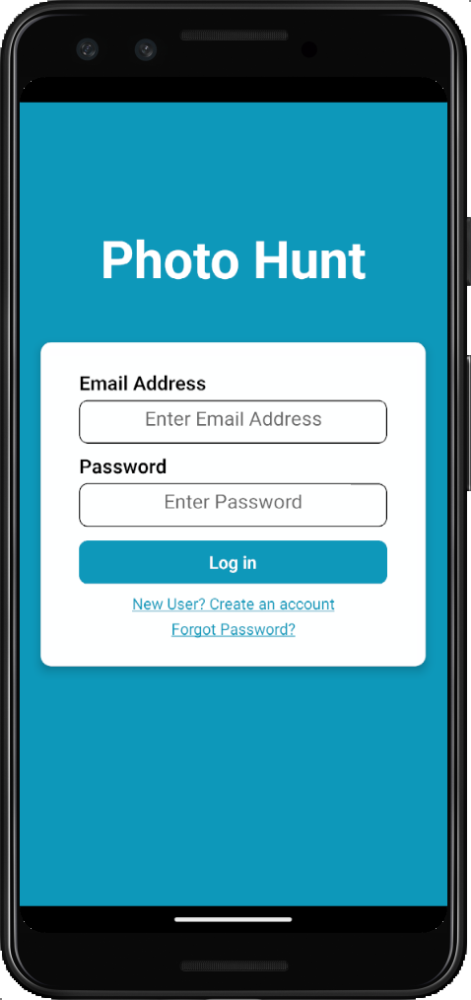
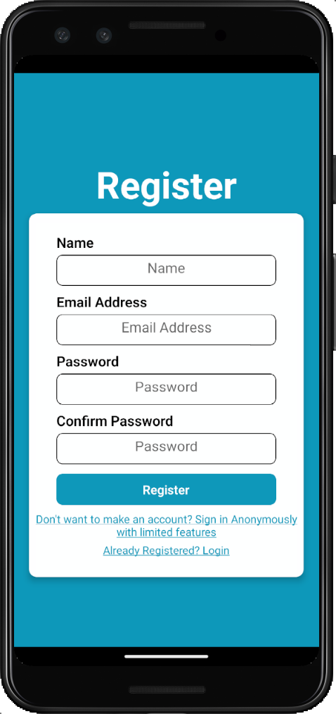
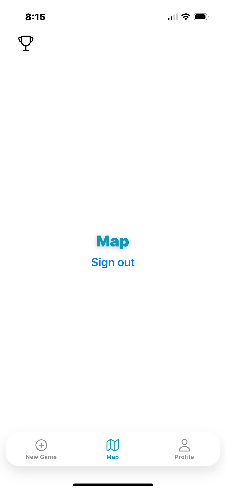
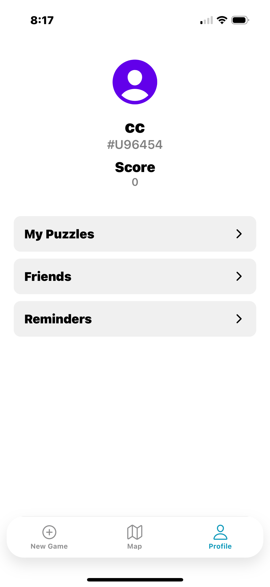
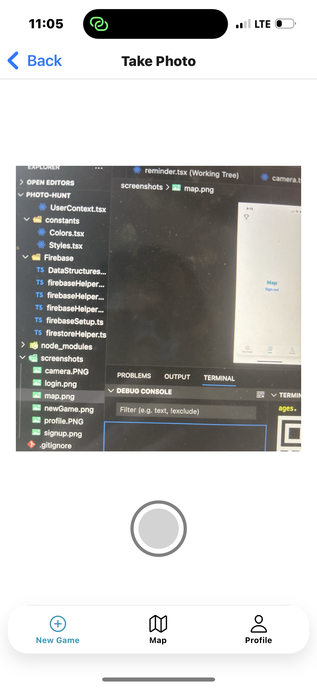
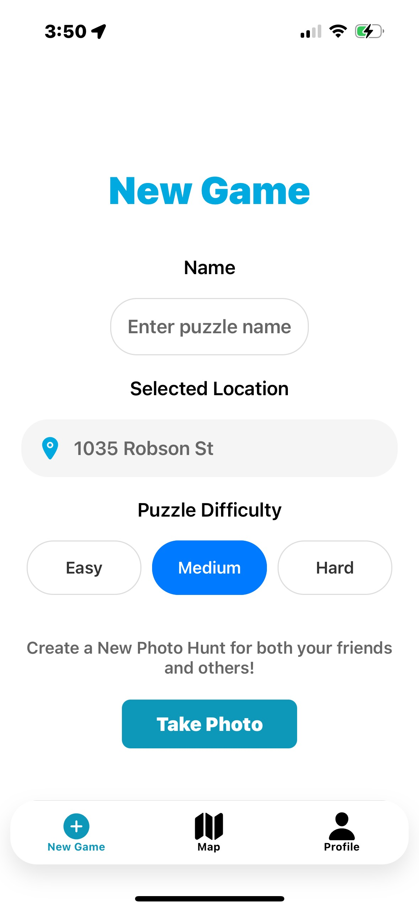

<h1>Photo Hunt</h1>
<h2>Description</h2>

Photo Hunt is an interactive puzzle game that turns your city into an adventure! Capture photos of unique locations, transform them into sliding puzzles, and challenge your friends to solve and find them. Using AI-powered image recognition, the app verifies if players take photos at the correct location before completing the puzzle and competing against their friends and others on the leaderboards!

<h2>Contributions</h2>

All the contributions to the project currently!

<h3>Ronald Mundell</h3>
<l>
<li>Setup of app and github</li>
<li>Created CRUD operations for the collections found under <b>CRUD Operations</b></li>
<li>Created components PressableAuthButton and PressableTextLink</li>
<li>Implmented User creation process including forgot password and anoynmous sign in found under <b>Authentication/User Creation Proccess</b></li>
<li>Assisted in app navigation logic/bug fixs</li>
</l>

<h3>Sisi You</h3>
<li>Implemented Stack & Tab Navigation under <b>Navigation</b></li>
<li>Co-developed Firebase setup</li>

<h2>Naviagtion</h2>

The navigation system is handled using expo-router, organizing pages under auth (authentication) and protected (gameplay). Navigation includes:

<li><b>Stack Navigation</b> for login and signup.</li>
<li><b>Tab Navigation</b> for switching between game modes.</li>
<li><b>Nested Navigation</b> within mapstack, newgamestack, and profilestack.</li>

<h2>Authentication/User Creation Proccess</h2>

The files and screens that handle the user creation process and what crud operations are involved.

<h2>Screenshots</h2>

  

    
    
<strong>Login Screen</strong>

  

  

    
    
<strong>Signup Screen</strong>

  

  

    
    
<strong>Map Screen</strong>

  

  

    
    
<strong>Profile Screen</strong>

  

  

    
    
<strong>Camera Screen</strong>

  

  

    
    
<strong>New Game Screen</strong>

  

<h2>Data Model</h2>

The app uses three main collections in the database:

<h3>Collections</h3>
<ul>
  <li><strong>Users</strong>: Stores user profiles and related information</li>
  <li><strong>Puzzles</strong>: Contains all created puzzles with their properties</li>
  <li><strong>Plays</strong>: Records gameplay sessions and scores</li>
</ul>
<h3>Data Structures</h3>
<h4>User Data</h4>
<ul>
  <li><strong>Basic Info</strong>: name, email, uid, photoURL, code</li>
  <li><strong>Stats</strong>: score</li>
  <li><strong>Relations</strong>:
    <ul>
      <li>List of friends (id, name)</li>
      <li>List of created puzzles (id, name, difficulty)</li>
    </ul>
  </li>
  <li><strong>Location</strong>: Current geographical coordinates</li>
</ul>
<h4>Puzzle Data</h4>
<ul>
  <li><strong>Identifiers</strong>: id, creatorID</li>
  <li><strong>Properties</strong>: name, difficulty</li>
  <li><strong>Content</strong>: photoURL</li>
  <li><strong>Location</strong>: Geographic coordinates where the puzzle is located</li>
</ul>
<h4>Play Data</h4>
<ul>
  <li><strong>Session Info</strong>: puzzleId, playerId</li>
  <li><strong>Details</strong>: name</li>
  <li><strong>Performance</strong>: score (based on number of moves)</li>
</ul>

<h2>CRUD Operations</h2>

All the implemented crud operation within the app.

<h3>Create</h3>

<b>createUserDocument:</b> 

<h3>Read</h3>

<h3>Update</h3>

<h3>Delete</h3>

<h2>Citations</h2>

