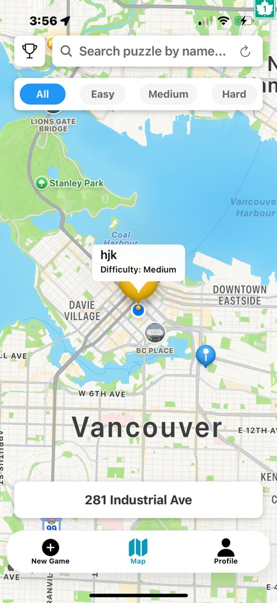

<h1>Photo Hunt</h1>
<h2>Description</h2>
<p>Photo Hunt is an interactive puzzle game that turns your city into an adventure! Capture photos of unique locations, transform them into sliding puzzles, and challenge your friends to solve and find them. Using AI-powered image recognition, the app verifies if players take photos at the correct location before completing the puzzle and competing against their friends and others on the leaderboards!</p>
<h3>Demo</h3>
<p><a href="https://www.youtube.com/watch?v=18Sh4UxvZps">https://www.youtube.com/watch?v=18Sh4UxvZps</a></p>
<h2>Contributions</h2>
<p>All the contributions to the project currently!</p>
<h3>Ronald Mundell</h3>
<p><a href="https://northeastern-my.sharepoint.com/:v:/g/personal/mundell_r_northeastern_edu/EZr8R2x1DWxGr4flVdmqEoUBCb0oMJN_SYaRO2ERJ7RP5A?e=yJxoDd">CodeWalk Iteration 1</a></p>
<p><a href="https://northeastern-my.sharepoint.com/:v:/r/personal/mundell_r_northeastern_edu/Documents/Iteration2-CodeWalk.webm?csf=1&web=1&e=HAjOdX">CodeWalk Iteration 2</a></p>
<p><a href="https://northeastern-my.sharepoint.com/:v:/r/personal/mundell_r_northeastern_edu/Documents/Iteration3-CodeWalk.webm?csf=1&web=1&e=OpsxCi&nav=eyJyZWZlcnJhbEluZm8iOnsicmVmZXJyYWxBcHAiOiJTdHJlYW1XZWJBcHAiLCJyZWZlcnJhbFZpZXciOiJTaGFyZURpYWxvZy1MaW5rIiwicmVmZXJyYWxBcHBQbGF0Zm9ybSI6IldlYiIsInJlZmVycmFsTW9kZSI6InZpZXcifX0%3D">CodeWalk Iteration 3</a></p>
<l>
<li>Setup of app and github</li>
<li>Created CRUD operations for the collections found under <b>CRUD Operations</b></li>
<li>Setup Firebase Rules</li>
<li>Created and refactored the app into components</li>
<li>Created the UserContext</li>
<li>Created the CreateAccountModal</li>
<li>Implemented User creation process including forgot password and anonymous sign in found under <b>Authentication/User Creation Process</b></li>
<li>Assisted in app navigation logic/bug fixes</li>
<li>Implemented friend request system including:
  <ul>
    <li>Send friend requests functionality</li>
    <li>Accept and reject friend requests</li>
    <li>Friend puzzle screen implementation</li>
    <li>Modified helper functions for friend information retrieval</li>
    <li>Updated request status display for outgoing requests</li>
  </ul>
</li>
<li>Enhanced UI/UX with bottom tab bar improvements and navigation flow optimization</li>
<li>Implemented notifications for users that can be set on individual puzzles that can be set a specified time</li>
<li>Implemented leaderboards and scoring mechanism and updated users scores</li>
<li>Bug fixes for puzzles and firebase image storage and retrieval</li>
<li>Implemented photo comparision between puzzle photo and verification photo using Azure Computer Vision</li>
</l>

<h3>Sisi You</h3>
<p><a href="https://northeastern.sharepoint.com/:v:/s/111396/EYIvINBagmhDoKTRfQYpvfUB3Q7I3Oq9YSaQTKU2tHNTBA?e=MqnbYw">CodeWalk Iteration 1</a></p>

<p><a href="32WZlcnJhbEluZm8iOnsicmVmZXJyYWxBcHAiOiJTdHJlYW1XZWJBcHAiLCJyZWZlcnJhbFZpZXciOiJTaGFyZURpYWxvZy1MaW5rIiwicmVmZXJyYWxBcHBQbGF0Zm9ybSI6IldlYiIsInJlZmVycmFsTW9kZSI6InZpZXcifX0%3D">CodeWalk Iteration 2</a></p>
<l>
<p><a href="https://northeastern.sharepoint.com/:v:/s/111396/EWLnzzoNTg1Hn-LhLIL-FbIBOGAW8yjCdHySez7bA4jUfw?e=UIWR0c&nav=eyJyZWZlcnJhbEluZm8iOnsicmVmZXJyYWxBcHAiOiJTdHJlYW1XZWJBcHAiLCJyZWZlcnJhbFZpZXciOiJTaGFyZURpYWxvZy1MaW5rIiwicmVmZXJyYWxBcHBQbGF0Zm9ybSI6IldlYiIsInJlZmVycmFsTW9kZSI6InZpZXcifX0%3D">CodeWalk Iteration 3</a></p>

<li>New Game Creation System:
  <ul>
    <li>Developed comprehensive puzzle creation workflow:
      <ul>
        <li>Dynamic puzzle grid generation</li>
        <li>Difficulty level implementation</li>
        <li>Implemented and configured Google Cloud Vision API integration for photo validation</li>
        <li>Location-based puzzle storage</li>
      </ul>
    </li>
    <li>Enhanced CameraScreen with:
      <ul>
        <li>Permission handling and validation</li>
        <li>Image aspect ratio optimization</li>
        <li>Real-time location verification</li>
      </ul>
    </li>
    <li>Implemented PuzzleScreen with:
      <ul>
        <li>Interactive sliding puzzle gameplay</li>
        <li>Move tracking and scoring</li>
        <li>Hint functions to help solve puzzles using A* algotithms</li>
        <li>Firebase integration for puzzle storage</li>
      </ul>
    </li>
  </ul>
</li>

<li>Map and Location Features:
  <ul>
    <li>Enhanced MapScreen with:
      <ul>
        <li>Real-time difficulty filtering system</li>
        <li>Puzzle search functionality</li>
        <li>Color-coded difficulty markers</li>
      </ul>
    </li>
    <li>Enhanced LocationManager with:
      <ul>
        <li>Location selection and validation</li>
        <li>Interactive marker system</li>
      </ul>
    </li>
  </ul>
</li>

<li>Profile and Puzzle Management:
  <ul>
    <li>Developed MyPuzzlesScreen featuring:
      <ul>
        <li>Personal puzzle collection management</li>
        <li>Difficulty level display</li>
        <li>Real-time puzzle list updates</li>
      </ul>
    </li>
    <li>Created ViewPuzzleScreen with:
      <ul>
        <li>Puzzle preview functionality</li>
        <li>Dynamic navigation handling</li>
        <li>Optimized image rendering</li>
      </ul>
    </li>
  </ul>
</li>

<li>Puzzle Verification and Scoring System:
  <ul>
    <li>Enhanced MarkerScreen with:
      <ul>
        <li>Dynamic difficulty display system</li>
        <li>Real-time top scores leaderboard</li>
        <li>Weighted scoring based on difficulty</li>
        <li>Integrated play/resume functionality</li>
      </ul>
    </li>
    <li>Developed ValidateCamera system:
      <ul>
        <li>Photo verification workflow</li>
        <li>Real-time image comparison</li>
        <li>Score calculation and leaderboard updates</li>
        <li>Completion status management</li>
      </ul>
    </li>
    <li>Implemented Image Comparison System:
      <ul>
        <li>Image feature extraction</li>
        <li>Similarity calculation algorithms</li>
        <li>Threshold-based verification</li>
      </ul>
    </li>
  </ul>
</li>
</l>

<h2>Naviagtion</h2>
<p>The navigation system is handled using expo-router, organizing pages under auth (authentication) and protected (gameplay). Navigation includes:</p>
<li><b>Stack Navigation</b> for login and signup.</li>
<li><b>Tab Navigation</b> for switching between the new game, map or profile stacks.</li>
<li><b>Nested Navigation</b> within mapstack, newgamestack, and profilestack.</li>

<h2>Screenshots Navigatoin</h2>
<div style="display: flex; flex-wrap: wrap; justify-content: space-between;">
    <div style="width: 25%; margin-bottom: 20px;">
    
    <p><strong>Profile Screen</strong></p>
  </div>
  <div style="width: 25%; margin-bottom: 20px;">
    
    <p><strong>Notification Pop Up</strong></p>
  </div>
    <div style="width: 25%; margin-bottom: 20px;">
    
    <p><strong>Reminder Screen</strong></p>
  </div>
  <div style="width: 25%; margin-bottom: 20px;">
    
    <p><strong>Friend Screen</strong></p>
  </div>
  <div style="width: 25%; margin-bottom: 20px;">
    
    <p><strong>MyPuzzle Screen</strong></p>
  </div>
 <div style="width: 25%; margin-bottom: 20px;">
    
    <p><strong>Map Screen</strong></p>
  </div>
  <div style="width: 25%; margin-bottom: 20px;">
    
    <p><strong>New Game Screen</strong></p>
  </div>
  <div style="width: 25%; margin-bottom: 20px;">
    
    <p><strong>Camera Screen</strong></p>
  </div>
    <div style="width: 25%; margin-bottom: 20px;">
    
    <p><strong>Marker Screen</strong></p>
  </div>
     <div style="width: 25%; margin-bottom: 20px;">
    
    <p><strong>Puzzle Screen</strong></p>
  </div>
      <div style="width: 25%; margin-bottom: 20px;">
    
    <p><strong>validateCamera Screen</strong></p>
  </div>
</div>

<h2>Authentication/User Creation Proccess</h2>
<p>The files and screens that handle authentication and user creation process.</p>


<h2>Screenshots Authentication</h2>
<div style="display: flex; flex-wrap: wrap; justify-content: space-between;">
  <div style="width: 25%; margin-bottom: 20px;">
    
    <p><strong>Login Screen</strong></p>
  </div>
  <div style="width: 25%; margin-bottom: 20px;">
    
    <p><strong>Signup Screen</strong></p>
  </div>
  <div style="width: 25%; margin-bottom: 20px;">
    
    <p><strong>Fogot Password Screen</strong></p>
  </div>
  <div style="width: 25%; margin-bottom: 20px;">
    
    <p><strong>Profile Screen</strong></p>
  </div>
  <div style="width: 25%; margin-bottom: 20px;">
    
    <p><strong>Create Password Errors Screen</strong></p>
  </div>
  <div style="width: 25%; margin-bottom: 20px;">
    
    <p><strong>Profile Anoynmous Screen</strong></p>
  </div>
  <div style="width: 25%; margin-bottom: 20px;">
    
    <p><strong>New Game Anoynmous Screen</strong></p>
  </div>
</div>

<h2>Data Model</h2>
<p>The app uses Firebase Firestore with three main collections:</p>

### Collections
- **Users**: Stores user profiles and related information
- **Puzzles**: Contains all created puzzles with their properties
- **Plays**: Records user gameplay sessions and scores

### Data Structures

#### User Data
User documents contain:
- name (string): User's display name
- email (string): User's email address
- uid (string): Unique user identifier
- photoURL (string): Profile picture URL
- code (string): Unique friend code
- score (number): User's total score
- friends: Array of friend data (id and name)
- mypuzzles: Array of created puzzles (id, name, difficulty)
- geoLocation: User's location (latitude and longitude)
- friendRequests: Array of friend requests (fromId, fromName, status)

#### Puzzle Data
Puzzle documents contain:
- id (string): Unique puzzle identifier
- creatorID (string): Creator's user ID
- name (string): Puzzle name
- photoURL (string): Puzzle image URL
- difficulty (number): 3 for Easy, 4 for Medium, 5 for Hard
- geoLocation: Puzzle location (latitude and longitude)

#### Play Data
Play records contain:
- puzzleId (string): ID of the played puzzle
- playerId (string): ID of the player
- name (string): Player's name
- score (number): Score achieved
- move (number): moves made

#### Supporting Types

**GeoLocation Data**
- latitude (number)
- longitude (number)

**Puzzle Mini Data**
- id (string)
- name (string)
- difficulty (number)

**Friend Data**
- id (string)
- name (string)

**Friend Request Data**
- name (string): Requester's name
- friendCode (string): Friend's unquie code
- requesterCode (string): Requester's unquie code
- friendName (string): Friend's Name
- status: Can be 'pending', 'accepted', or 'rejected'

<h2>CRUD Operations</h2>
<p>Firebase operations implemented in the application:</p>

<h3>Create</h3>
<l>
<li><b>createUserDocument</b>
  <ul>
    <li>Creates new user profile in "Users" collection</li>
    <li>Generates unique friend code</li>
    <li>Initializes user stats and collections</li>
  </ul>
</li>
<li><b>createPuzzleDocument</b>
  <ul>
    <li>Creates new puzzle in "Puzzles" collection</li>
    <li>Handles image storage and location data</li>
    <li>Updates creator's mypuzzles array</li>
  </ul>
</li>
<li><b>createPlayDocument</b>
  <ul>
    <li>Records new gameplay session</li>
    <li>Stores player performance data</li>
  </ul>
</li>
<li><b>sendFriendRequest</b>
  <ul>
    <li>sends a friend request to another user</li>
    <li>creates a request</li>
  </ul>
</li>
</l>

<h3>Read</h3>
<l>
<li><b>getUserData</b>
  <ul>
    <li>Retrieves user profile by UID</li>
    <li>Includes friends list and puzzle collection</li>
  </ul>
</li>
<li><b>getPuzzleData</b>
  <ul>
    <li>Fetches puzzle details by ID</li>
    <li>Includes creator and location information</li>
  </ul>
</li>
<li><b>getLocalPuzzles</b>
  <ul>
    <li>Retrieves puzzles within specified radius</li>
    <li>Uses haversine distance calculation</li>
    <li>Supports difficulty filtering</li>
  </ul>
</li>
<li><b>getPuzzleLeaderBoard</b>
  <ul>
    <li>Fetches puzzle completion records</li>
    <li>Orders by score/completion time</li>
  </ul>
</li>
<li><b>getFriend</b>
  <ul>
    <li>Looks up user by friend code</li>
    <li>Returns basic profile information</li>
  </ul>
</li>
</l>

<h3>Update</h3>
<l>
<li><b>updateUserDocument</b>
  <ul>
    <li>Updates user profile information</li>
    <li>Handles friend list modifications</li>
    <li>Updates puzzle collection</li>
    <li>Manages friend requests</li>
  </ul>
</li>
<li><b>updatePlayDataDocument</b>
  <ul>
    <li>Updates gameplay session data</li>
    <li>Records completion time and score</li>
  </ul>
</li>
<li><b>acceptDenyRequest</b>
  <ul>
    <li>accepts or denys a friend request</li>
    <li>updates the friend request document with the new status</li>
  </ul>
</li>
</l>

<h3>Delete</h3>
<l>
<li><b>deleteUserDocument</b>
  <ul>
    <li>Removes user profile</li>
    <li>Cleans up associated data</li>
  </ul>
</li>
<li><b>deletePuzzleDocument</b>
  <ul>
    <li>Removes puzzle from collection</li>
    <li>Updates creator's puzzle list</li>
    <li>Removes associated image data</li>
  </ul>
</li>
<li><b>deletePlayDataDocument</b>
  <ul>
    <li>Removes specific gameplay record</li>
  </ul>
</li>
</l>

<h3>Special Operations</h3>
<l>
<li><b>storeImage</b>
  <ul>
    <li>Handles image upload to Firebase Storage</li>
    <li>Returns storage reference path</li>
  </ul>
</li>
<li><b>uploadImageAzureFirebase</b>
  <ul>
  <li>uploads image for purpose for photo verification</li>
  <li>returns the storage download url</li>
  </ul>
</li>
<li><b>deleteImage</b>
  <ul>
  <li>deletes stored based on downloadurl of image</li>
  </ul>
</li>
</l>

<h2>Firestore Security Rules</h2>
  <p>This document defines the security rules for accessing Firestore documents. Additionally as most aspects of our app require users to be able to view eachothers information and created documents thuswe allow reading for all data for signed in users but limit updating and writing to users with correct ownership.</p>
  <pre><code>service cloud.firestore {
  match /databases/{database}/documents {
    // General rule for all documents (should be more restrictive)
    match /{document=**} {
      allow read, write: if request.auth != null;
    }

    // Rules for puzzles: Only creator can write, all authenticated users can read
    match /puzzles/{puzzle} {
      allow write: if request.auth != null && request.auth.uid == resource.data.creatorID;
      allow read: if request.auth != null;
    }
    
    // Rules for play data: Only creator can write & update, all authenticated users can read
    match /playdata/{play} {
      allow write, update: if request.auth != null && request.auth.uid == resource.data.playerID;
      allow read: if request.auth != null;
    }

    // Rules for requests
    match /requests/{request} {
      allow read, update, write: if request.auth != null;
    }

     // Rules for users: Each user can only modify their own data
    match /users/{user} {
    	allow create: if request.auth != null && request.auth.uid == request.resource.data.uid;
      allow update, write: if request.auth != null && request.auth.uid == resource.data.uid;
      allow read: if request.auth != null;
    }
  }
}</code></pre>

<h2>Citations</h2>
<p></p>

<h2>Installation and Setup</h2>

<h3>Prerequisites</h3>
<ul>
  <li>Node.js (v18 or higher)</li>
  <li>npm or yarn</li>
  <li>Expo CLI (`npm install -g expo-cli`)</li>
  <li>Expo Go app on your mobile device</li>
</ul>

<h3>Environment Setup</h3>

1. Clone the repository:
```bash
git clone https://github.com/your-username/Photo-Hunt.git
cd Photo-Hunt
```

1. Install dependencies:
```bash
npm install
```

1. Required Configuration Files:

<h4>Service Account Setup</h4>
<p>The app requires a Google Cloud Vision API service account for photo validation. Follow these steps:</p>

1. Create a file named `service-account.json` in the `config` directory
2. Contact the development team to obtain the service account credentials
3. The file structure should look like this:
```json
{
  "type": "service_account",
  "project_id": "your-project-id",
  "private_key_id": "your-private-key-id",
  "private_key": "your-private-key",
  "client_email": "your-client-email",
  "client_id": "your-client-id",
  "auth_uri": "https://accounts.google.com/o/oauth2/auth",
  "token_uri": "https://oauth2.googleapis.com/token",
  "auth_provider_x509_cert_url": "https://www.googleapis.com/oauth2/v1/certs",
  "client_x509_cert_url": "your-cert-url"
}
```

<h4>Azure Computer Vision</h4>
<p>The app requires a Azure Computer Vision API for photo comparision. Follow these steps:</p>

1. Create a file named `azure-endpoints.js` in the `config` directory
2. Contact the development team to obtain the service account credentials
3. The file structure should look like this:
```javascript
export const azureEndpoints = {
  "Endpoint":"your-endpoint/vision/v3.2/analyze?visualFeatures=Tags,Description",
  "Key":"your-key"  
}
```

<h3>Running the App</h3>

1. Start the development server:
```bash
npx expo start
```

2. Running on a physical device:
   - Install Expo Go on your mobile device
   - Scan the QR code shown in the terminal with:
     - iOS: Camera app
     - Android: Expo Go app

3. Running on simulators:
   - iOS (requires macOS):
     ```bash
     npx expo start --ios
     ```
   - Android:
     ```bash
     npx expo start --android
     ```

<h3>Troubleshooting</h3>
<ul>
  <li>If you encounter any issues with dependencies, try:
    ```bash
    npm install
    npx expo install
    ```
  </li>
  <li>For camera permissions issues, ensure you've granted necessary permissions in your device settings</li>
  <li>If the app fails to connect to Firebase, verify your network connection and Firebase configuration</li>
</ul>

<h3>Development Notes</h3>
<ul>
  <li>The app requires location services to be enabled for full functionality</li>
  <li>Photo validation requires an active internet connection</li>
  <li>For testing puzzle creation, ensure you have access to locations with recognizable landmarks or buildings</li>
</ul>

<h2>State Management</h2>
<p>The application uses React's Context API for state management, implementing several context providers to handle different aspects of the application state.</p>

<h3>Context Providers</h3>

<h4>1. User Context</h4>
<p>Manages user authentication and profile state throughout the application.</p>
<ul>
  <li><strong>Location:</strong> `components/UserContext`</li>
  <li><strong>Key Features:</strong>
    <ul>
      <li>User authentication state</li>
      <li>User profile data management</li>
      <li>Real-time user data updates</li>
    </ul>
  </li>
  <li><strong>Usage Example:</strong>
    ```typescript
    const { user } = useUser();
    ```
  </li>
</ul>

<h4>2. Selected Location Context</h4>
<p>Handles the state of selected locations for puzzle creation and gameplay.</p>
<ul>
  <li><strong>Location:</strong> `components/SelectedLocationContext`</li>
  <li><strong>Key Features:</strong>
    <ul>
      <li>Current selected location coordinates</li>
      <li>Location name and metadata</li>
      <li>Location selection state for puzzle creation</li>
    </ul>
  </li>
  <li><strong>Usage Example:</strong>
    ```typescript
    const { selectedLocation } = useSelectedLocation();
    ```
  </li>
</ul>

