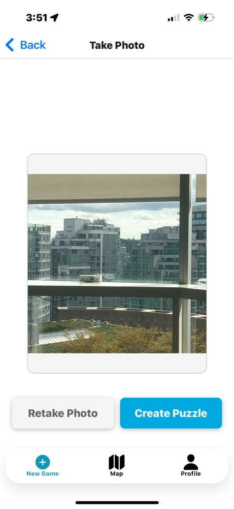

<h1>Photo Hunt</h1>
<h2>Description</h2>

Photo Hunt is an interactive puzzle game that turns your city into an adventure! Capture photos of unique locations, transform them into sliding puzzles, and challenge your friends to solve and find them. Using AI-powered image recognition, the app verifies if players take photos at the correct location before completing the puzzle and competing against their friends and others on the leaderboards!

<h2>Contributions</h2>

All the contributions to the project currently!

<h3>Ronald Mundell</h3>

<a href="https://northeastern-my.sharepoint.com/:v:/g/personal/mundell_r_northeastern_edu/EZr8R2x1DWxGr4flVdmqEoUBCb0oMJN_SYaRO2ERJ7RP5A?e=yJxoDd">CodeWalk Iteration 1</a>

<l>
<li>Setup of app and github</li>
<li>Created CRUD operations for the collections found under <b>CRUD Operations</b></li>
<li>Created and refactored the app into components</li>
<li>Created the UserContext</li>
<li>Created the CreateAccountModal</li>
<li>Implmented User creation process including forgot password and anoynmous sign in found under <b>Authentication/User Creation Proccess</b></li>
<li>Assisted in app navigation logic/bug fixs</li>
</l>

<h3>Sisi You</h3>

<a href="https://northeastern-my.sharepoint.com/:v:/g/personal/mundell_r_northeastern_edu/EZr8R2x1DWxGr4flVdmqEoUBCb0oMJN_SYaRO2ERJ7RP5A?e=yJxoDd](https://northeastern.sharepoint.com/:v:/s/111396/EYIvINBagmhDoKTRfQYpvfUB3Q7I3Oq9YSaQTKU2tHNTBA?e=MqnbYw&nav=eyJyZWZlcnJhbEluZm8iOnsicmVmZXJyYWxBcHAiOiJTdHJlYW1XZWJBcHAiLCJyZWZlcnJhbFZpZXciOiJTaGFyZURpYWxvZy1MaW5rIiwicmVmZXJyYWxBcHBQbGF0Zm9ybSI6IldlYiIsInJlZmVycmFsTW9kZSI6InZpZXcifX0%3D)">CodeWalk Iteration 1</a>

<l>
<li>Implemented Stack & Tab Navigation under <b>Navigation</b></li>
<li>Co-developed Firebase setup</li>
</l>

<h2>Naviagtion</h2>

The navigation system is handled using expo-router, organizing pages under auth (authentication) and protected (gameplay). Navigation includes:

<li><b>Stack Navigation</b> for login and signup.</li>
<li><b>Tab Navigation</b> for switching between the new game, map or profile stacks.</li>
<li><b>Nested Navigation</b> within mapstack, newgamestack, and profilestack.</li>

<h2>Screenshots Navigatoin</h2>

    

    
    
<strong>Profile Screen</strong>

  

    

    
    
<strong>Reminder Screen</strong>

  

  

    
    
<strong>Friend Screen</strong>

  

  

    
    
<strong>MyPuzzle Screen</strong>

  

 

    
    
<strong>Map Screen</strong>

  

  

    
    
<strong>New Game Screen</strong>

  

  

    
    
<strong>Camera Screen</strong>

  

<h2>Authentication/User Creation Proccess</h2>

The files and screens that handle authentication and user creation process.

<h2>Screenshots Authentication</h2>

  

    
    
<strong>Login Screen</strong>

  

  

    
    
<strong>Signup Screen</strong>

  

  

    
    
<strong>Fogot Password Screen</strong>

  

  

    
    
<strong>Profile Screen</strong>

  

  

    
    
<strong>Profile Anoynmous Screen</strong>

  

<h2>Data Model</h2>

The app uses three main collections in the database:

<h3>Collections</h3>
<ul>
  <li><strong>Users</strong>: Stores user profiles and related information</li>
  <li><strong>Puzzles</strong>: Contains all created puzzles with their properties</li>
  <li><strong>Plays</strong>: Records user gameplay sessions and scores</li>
</ul>
<h3>Data Structures</h3>
<h4>User Data</h4>
<ul>
  <li><strong>Basic Info</strong>: name, email, uid, photoURL, code</li>
  <li><strong>Stats</strong>: score</li>
  <li><strong>Relations</strong>:
    <ul>
      <li>List of friends (id, name)</li>
      <li>List of created puzzles (id, name, difficulty)</li>
    </ul>
  </li>
  <li><strong>Location</strong>: Current geographical coordinates</li>
</ul>
<h4>Puzzle Data</h4>
<ul>
  <li><strong>Identifiers</strong>: id, creatorID</li>
  <li><strong>Properties</strong>: name, difficulty</li>
  <li><strong>Content</strong>: photoURL</li>
  <li><strong>Location</strong>: Geographic coordinates where the puzzle is located</li>
</ul>
<h4>Play Data</h4>
<ul>
  <li><strong>Session Info</strong>: puzzleId, playerId</li>
  <li><strong>Details</strong>: name</li>
  <li><strong>Performance</strong>: score (based on number of moves)</li>
</ul>

<h2>CRUD Operations</h2>

All the implemented CRUD operation within the app.

<h3>Create</h3>
<l>
<li><b>createUserDocument:</b> creates the user document within the "Users" collection and generates a unquie friend code for this user.</li>
<li><b>createPlayDocument:</b> creates the a playdata document within the "Plays" collection.</li>
<li><b>createPuzzleDocument:</b> creates the Puzzle document within the "Puzzles" collection.</li>
</l>

<h3>Read</h3>
<l>
<li><b>getPuzzleLeaderBoard:</b> gets the information of all play data from a specific puzzle within the "Plays" collection.</li>
<li><b> getLocalLeaderBoard:</b> gets the information of all scores for players with 100 miles of a location within the "Users" collection.</li>
<li><b>getLocalPuzzles:</b> gets the puzzles within 10 miles of a specific location within the "Puzzles" collection.</li>
<li><b>getPuzzleData:</b> gets the puzzle data of a specific puzzle within the "Puzzles" collection.</li>
<li><b> getFriend:</b> gets the information a User by their friend code within the "Users" collection.</li>
<li><b> getUserData:</b> gets the specific information of User by their uid within the "Users" collection.</li>
</l>

<h3>Update</h3>
<l>
<li><b>updateUserDocument:</b> updates the user document within the "Users" collection.</li>
<li><b>updatePlayDataDocument:</b> updates a specific playdata document within the "Plays" collection.</li>
</l>

<h3>Delete</h3>
<l>
<li><b>deleteUserDocument:</b> deletes a users Document within the "Users" collection.</li>
<li><b>deletePlayDataDocument:</b> deletes a specific playdata document within the "Plays" collection.</li>
<li><b>deletePuzzleDocument:</b> deletes a specific puzzle document within the "Puzzles" collection.</li>
</l>

<h2>Citations</h2>

