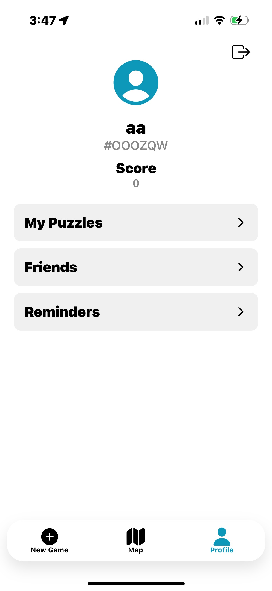
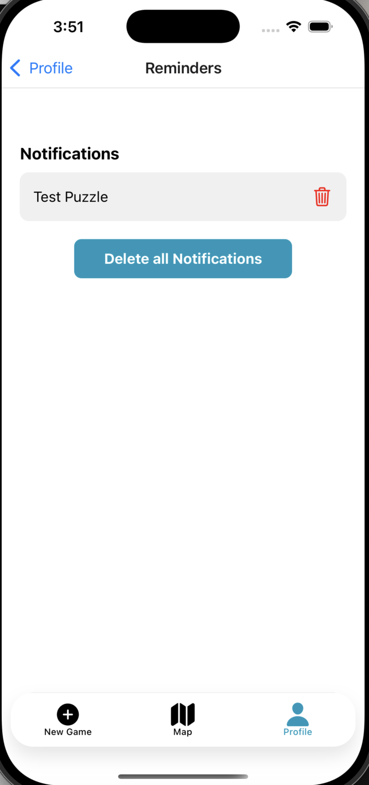

<h1>Photo Hunt</h1>
<h2>Description</h2>
<p>Photo Hunt is an interactive puzzle game that turns your city into an adventure! Capture photos of unique locations, transform them into sliding puzzles, and challenge your friends to solve and find them. Using AI-powered image recognition, the app verifies if players take photos at the correct location before completing the puzzle and competing against their friends and others on the leaderboards!</p>
<h2>Contributions</h2>
<p>All the contributions to the project currently!</p>
<h3>Ronald Mundell</h3>
<p><a href="https://northeastern-my.sharepoint.com/:v:/g/personal/mundell_r_northeastern_edu/EZr8R2x1DWxGr4flVdmqEoUBCb0oMJN_SYaRO2ERJ7RP5A?e=yJxoDd">CodeWalk Iteration 1</a></p>
<l>
<li>Setup of app and github</li>
<li>Created CRUD operations for the collections found under <b>CRUD Operations</b></li>
<li>Created and refactored the app into components</li>
<li>Created the UserContext</li>
<li>Created the CreateAccountModal</li>
<li>Implemented User creation process including forgot password and anonymous sign in found under <b>Authentication/User Creation Process</b></li>
<li>Assisted in app navigation logic/bug fixes</li>
<li>Implemented friend request system including:
  <ul>
    <li>Send friend requests functionality</li>
    <li>Accept and reject friend requests</li>
    <li>Friend puzzle screen implementation</li>
    <li>Modified helper functions for friend information retrieval</li>
    <li>Updated request status display for outgoing requests</li>
  </ul>
</li>
<li>Enhanced UI/UX with bottom tab bar improvements and navigation flow optimization</li>
</l>

<h3>Sisi You</h3>
<p><a href="https://northeastern.sharepoint.com/:v:/s/111396/EYIvINBagmhDoKTRfQYpvfUB3Q7I3Oq9YSaQTKU2tHNTBA?e=MqnbYw">CodeWalk Iteration 1</a></p>
<l>
<li>Implemented Stack & Tab Navigation under <b>Navigation</b></li>
<li>Co-developed Firebase setup</li>
<li>Developed New Game creation functionality:
  <ul>
    <li>Implemented photo capture functionality</li>
    <li>Created puzzle generation from photos</li>
    <li>Implemented puzzle storage in user profiles</li>
    <li>Integrated Google Cloud Vision API for photo validation:
      <ul>
        <li>Landmark and building detection</li>
        <li>Face detection for privacy protection</li>
        <li>Automatic validation of appropriate photo content</li>
      </ul>
    </li>
  </ul>
</li>
<li>Enhanced Map Screen features:
  <ul>
    <li>Added interactive location markers for puzzle viewing</li>
    <li>Implemented search bar functionality</li>
    <li>Added puzzle difficulty filtering</li>
  </ul>
</li>
</l>

<h2>Naviagtion</h2>
<p>The navigation system is handled using expo-router, organizing pages under auth (authentication) and protected (gameplay). Navigation includes:</p>
<li><b>Stack Navigation</b> for login and signup.</li>
<li><b>Tab Navigation</b> for switching between the new game, map or profile stacks.</li>
<li><b>Nested Navigation</b> within mapstack, newgamestack, and profilestack.</li>

<h2>Screenshots Navigatoin</h2>
<div style="display: flex; flex-wrap: wrap; justify-content: space-between;">
    <div style="width: 25%; margin-bottom: 20px;">
    
    <p><strong>Profile Screen</strong></p>
  </div>
    <div style="width: 25%; margin-bottom: 20px;">
    
    <p><strong>Reminder Screen</strong></p>
  </div>
  <div style="width: 25%; margin-bottom: 20px;">
    
    <p><strong>Friend Screen</strong></p>
  </div>
  <div style="width: 25%; margin-bottom: 20px;">
    
    <p><strong>MyPuzzle Screen</strong></p>
  </div>
 <div style="width: 25%; margin-bottom: 20px;">
    
    <p><strong>Map Screen</strong></p>
  </div>
  <div style="width: 25%; margin-bottom: 20px;">
    
    <p><strong>New Game Screen</strong></p>
  </div>
  <div style="width: 25%; margin-bottom: 20px;">
    
    <p><strong>Camera Screen</strong></p>
  </div>
    <div style="width: 25%; margin-bottom: 20px;">
    
    <p><strong>Puzzle Screen</strong></p>
  </div>
</div>

<h2>Authentication/User Creation Proccess</h2>
<p>The files and screens that handle authentication and user creation process.</p>


<h2>Screenshots Authentication</h2>
<div style="display: flex; flex-wrap: wrap; justify-content: space-between;">
  <div style="width: 25%; margin-bottom: 20px;">
    
    <p><strong>Login Screen</strong></p>
  </div>
  <div style="width: 25%; margin-bottom: 20px;">
    
    <p><strong>Signup Screen</strong></p>
  </div>
  <div style="width: 25%; margin-bottom: 20px;">
    
    <p><strong>Fogot Password Screen</strong></p>
  </div>
  <div style="width: 25%; margin-bottom: 20px;">
    
    <p><strong>Profile Screen</strong></p>
  </div>
  <div style="width: 25%; margin-bottom: 20px;">
    
    <p><strong>Profile Anoynmous Screen</strong></p>
  </div>
</div>

<h2>Data Model</h2>
<p>The app uses three main collections in the database:</p>
<h3>Collections</h3>
<ul>
  <li><strong>Users</strong>: Stores user profiles and related information</li>
  <li><strong>Puzzles</strong>: Contains all created puzzles with their properties</li>
  <li><strong>Plays</strong>: Records user gameplay sessions and scores</li>
</ul>
<h3>Data Structures</h3>
<h4>User Data</h4>
<ul>
  <li><strong>Basic Info</strong>: name, email, uid, photoURL, code</li>
  <li><strong>Stats</strong>: score</li>
  <li><strong>Relations</strong>:
    <ul>
      <li>List of friends (id, name)</li>
      <li>List of created puzzles (id, name, difficulty)</li>
    </ul>
  </li>
  <li><strong>Location</strong>: Current geographical coordinates</li>
</ul>
<h4>Puzzle Data</h4>
<ul>
  <li><strong>Identifiers</strong>: id, creatorID</li>
  <li><strong>Properties</strong>: name, difficulty</li>
  <li><strong>Content</strong>: photoURL</li>
  <li><strong>Location</strong>: Geographic coordinates where the puzzle is located</li>
</ul>
<h4>Play Data</h4>
<ul>
  <li><strong>Session Info</strong>: puzzleId, playerId</li>
  <li><strong>Details</strong>: name</li>
  <li><strong>Performance</strong>: score (based on number of moves)</li>
</ul>

<h2>CRUD Operations</h2>
<p>All the implemented CRUD operation within the app.</p>

<h3>Create</h3>
<l>
<li><b>createUserDocument:</b> creates the user document within the "Users" collection and generates a unquie friend code for this user.</li>
<li><b>createPlayDocument:</b> creates the a playdata document within the "Plays" collection.</li>
<li><b>createPuzzleDocument:</b> creates the Puzzle document within the "Puzzles" collection.</li>
</l>

<h3>Read</h3>
<l>
<li><b>getPuzzleLeaderBoard:</b> gets the information of all play data from a specific puzzle within the "Plays" collection.</li>
<li><b> getLocalLeaderBoard:</b> gets the information of all scores for players with 100 miles of a location within the "Users" collection.</li>
<li><b>getLocalPuzzles:</b> gets the puzzles within 10 miles of a specific location within the "Puzzles" collection.</li>
<li><b>getPuzzleData:</b> gets the puzzle data of a specific puzzle within the "Puzzles" collection.</li>
<li><b> getFriend:</b> gets the information a User by their friend code within the "Users" collection.</li>
<li><b> getUserData:</b> gets the specific information of User by their uid within the "Users" collection.</li>
</l>

<h3>Update</h3>
<l>
<li><b>updateUserDocument:</b> updates the user document within the "Users" collection.</li>
<li><b>updatePlayDataDocument:</b> updates a specific playdata document within the "Plays" collection.</li>
</l>


<h3>Delete</h3>
<l>
<li><b>deleteUserDocument:</b> deletes a users Document within the "Users" collection.</li>
<li><b>deletePlayDataDocument:</b> deletes a specific playdata document within the "Plays" collection.</li>
<li><b>deletePuzzleDocument:</b> deletes a specific puzzle document within the "Puzzles" collection.</li>
</l>

<h2>Citations</h2>
<p></p>

<h2>Installation and Setup</h2>

<h3>Prerequisites</h3>
<ul>
  <li>Node.js (v18 or higher)</li>
  <li>npm or yarn</li>
  <li>Expo CLI (`npm install -g expo-cli`)</li>
  <li>Expo Go app on your mobile device</li>
</ul>

<h3>Environment Setup</h3>

1. Clone the repository:
```bash
git clone https://github.com/your-username/Photo-Hunt.git
cd Photo-Hunt
```

2. Install dependencies:
```bash
npm install
```

3. Required Configuration Files:

<h4>Service Account Setup</h4>
<p>The app requires a Google Cloud Vision API service account for photo validation. Follow these steps:</p>

1. Create a file named `service-account.json` in the `config` directory
2. Contact the development team to obtain the service account credentials
3. The file structure should look like this:
```json
{
  "type": "service_account",
  "project_id": "your-project-id",
  "private_key_id": "your-private-key-id",
  "private_key": "your-private-key",
  "client_email": "your-client-email",
  "client_id": "your-client-id",
  "auth_uri": "https://accounts.google.com/o/oauth2/auth",
  "token_uri": "https://oauth2.googleapis.com/token",
  "auth_provider_x509_cert_url": "https://www.googleapis.com/oauth2/v1/certs",
  "client_x509_cert_url": "your-cert-url"
}
```

<h3>Running the App</h3>

1. Start the development server:
```bash
npx expo start
```

2. Running on a physical device:
   - Install Expo Go on your mobile device
   - Scan the QR code shown in the terminal with:
     - iOS: Camera app
     - Android: Expo Go app

3. Running on simulators:
   - iOS (requires macOS):
     ```bash
     npx expo start --ios
     ```
   - Android:
     ```bash
     npx expo start --android
     ```

<h3>Troubleshooting</h3>
<ul>
  <li>If you encounter any issues with dependencies, try:
    ```bash
    npm install
    npx expo install
    ```
  </li>
  <li>For camera permissions issues, ensure you've granted necessary permissions in your device settings</li>
  <li>If the app fails to connect to Firebase, verify your network connection and Firebase configuration</li>
</ul>

<h3>Development Notes</h3>
<ul>
  <li>The app requires location services to be enabled for full functionality</li>
  <li>Photo validation requires an active internet connection</li>
  <li>For testing puzzle creation, ensure you have access to locations with recognizable landmarks or buildings</li>
</ul>

<h2>State Management</h2>
<p>The application uses React's Context API for state management, implementing several context providers to handle different aspects of the application state.</p>

<h3>Context Providers</h3>

<h4>1. User Context</h4>
<p>Manages user authentication and profile state throughout the application.</p>
<ul>
  <li><strong>Location:</strong> `components/UserContext`</li>
  <li><strong>Key Features:</strong>
    <ul>
      <li>User authentication state</li>
      <li>User profile data management</li>
      <li>Real-time user data updates</li>
    </ul>
  </li>
  <li><strong>Usage Example:</strong>
    ```typescript
    const { user } = useUser();
    ```
  </li>
</ul>

<h4>2. Selected Location Context</h4>
<p>Handles the state of selected locations for puzzle creation and gameplay.</p>
<ul>
  <li><strong>Location:</strong> `components/SelectedLocationContext`</li>
  <li><strong>Key Features:</strong>
    <ul>
      <li>Current selected location coordinates</li>
      <li>Location name and metadata</li>
      <li>Location selection state for puzzle creation</li>
    </ul>
  </li>
  <li><strong>Usage Example:</strong>
    ```typescript
    const { selectedLocation } = useSelectedLocation();
    ```
  </li>
</ul>

<h3>State Flow</h3>
<p>The application follows a hierarchical state management pattern:</p>
